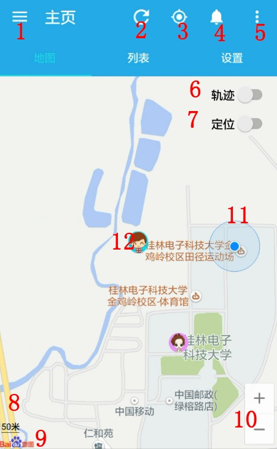
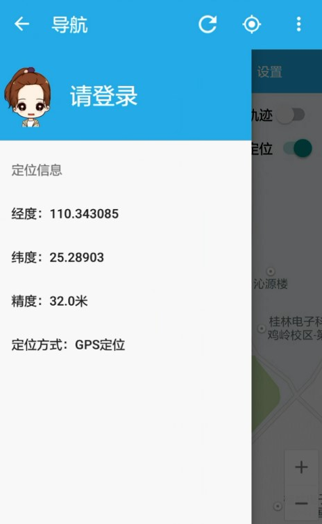
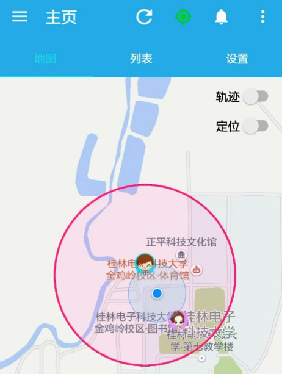
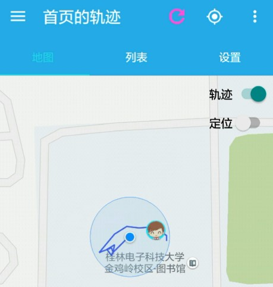

# 基于百度地图 SDK 的多人地图 Android 客户端

## 项目简介

Android 手机客户端，基于百度地图 SDK 实现，本项目已实现如下功能：

- 本终端的实时定位、轨迹追踪及显示。

- 对其他用户实时定位，并可在地图上实时绘制被定位人的位置。

- 可在地图上实时绘制被定位人实时运行轨迹及历史运行轨迹。

- 客户端实现对其他客户端手机用户位置信息、轨迹信息实时查询及管理。

- 当某用户移动离开指定区域或移动进入指定区域时，可实现对该用户的报警并实现对被报警人位置信息的显示。

## 项目成果

**第十一届中国研究生电子设计竞赛华南赛区二等奖**

参赛并获奖的作品视频展示已上传至优酷，请点击观看：

[中国研究生电子设计竞赛 - 华南赛区二等奖 - 自助出行用户安全系统](http://v.youku.com/v_show/id_XMjkwMjk5NDgxNg==.html)

## 运行说明

- 操作系统：Android 4.4「API19」及以上

- 时间原因，暂时取消对 Android 6.0「API23」动态权限申请的支持

- 由于百度地图 SDK 的 API 不时进行变动，不保证当前项目仍然运行正常

## [Wiki](https://github.com/bitkylin/MapForTour/wiki)

项目的更多详情信息请参见项目的 Wiki

### 1. [项目说明](https://github.com/bitkylin/MapForTour/wiki)

### 2. [软件界面及登录](https://github.com/bitkylin/MapForTour/wiki/软件界面及登录)

### 3. [显示用户位置信息](https://github.com/bitkylin/MapForTour/wiki/显示用户位置信息)

### 4. [用户运行轨迹显示与检索](https://github.com/bitkylin/MapForTour/wiki/用户运行轨迹显示与检索)

### 5. [地理围栏报警](https://github.com/bitkylin/MapForTour/wiki/地理围栏报警)

## 项目展示

### [主界面](https://github.com/bitkylin/MapForTour/wiki/软件界面及登录)

点击应用程序的图标，启动应用，初始化完毕后即可打开应用程序，并进入应用程序的主界面：

1. 导航按钮，点击可打开侧划菜单

2. 轨迹状态按钮，打开轨迹此按钮会被点亮，点击此按钮可清除轨迹

3. 围栏按钮，打开围栏此按钮会被点亮，点击此按钮可清除围栏

4. 报警按钮，接收到管理员的报警信息此按钮会被点亮，点击此按钮可执行管理员所指示的操作。

5. 更多按钮，点击此按钮可显示工具栏中不常用的功能。

6. 轨迹开关，打开此开关可显示本机的实时轨迹，关闭此开关可关闭所有轨迹

7. 定位按钮，打开此开关可锁定本机的实时位置，关闭此开关可解除实时位置锁定

8. 比例尺

9. 百度地图 LOGO

10. 地图缩放按钮

11. 本机位置及精度范围

12. 其他用户标识

### 侧划菜单

### 用户信息弹窗

### [地理围栏报警](https://github.com/bitkylin/MapForTour/wiki/地理围栏报警)

开启地理围栏后，从服务器调取围栏所监控的所有用户状态信息。调用监控对象状态回调接口，并接收监控对象之于围栏的状态，并将状态显示在用户信息列表中。

当某用户移动离开围栏所标识的范围时，此时围栏监控的用户状态发生了改变，告知管理员被监视用户的状态。当前通知指示某用户已经离开了所设定的地理围栏。

### [轨迹实时绘制](https://github.com/bitkylin/MapForTour/wiki/用户运行轨迹显示与检索)

对本机实时位置进行查询，并不断将获取到的位置信息记录下来。用户打开地图的「轨迹」开关时，在地图上建立折线覆盖物，并将位置信息添加进此对象中，刷新地图覆盖物的显示，从而显示出本机的实时运行轨迹。用户关闭「轨迹」开关时，则清除地图上已经建立的折线覆盖物，即清空轨迹信息。

## [License](https://github.com/bitkylin/MapForTour/blob/master/LICENSE)

> MIT License
> 
> Copyright (c) 2017 123lml123
> 
> Permission is hereby granted, free of charge, to any person obtaining a copy
> of this software and associated documentation files (the "Software"), to deal
> in the Software without restriction, including without limitation the rights
> to use, copy, modify, merge, publish, distribute, sublicense, and/or sell
> copies of the Software, and to permit persons to whom the Software is
> furnished to do so, subject to the following conditions:
> 
> The above copyright notice and this permission notice shall be included in all
> copies or substantial portions of the Software.
> 
> THE SOFTWARE IS PROVIDED "AS IS", WITHOUT WARRANTY OF ANY KIND, EXPRESS OR
> IMPLIED, INCLUDING BUT NOT LIMITED TO THE WARRANTIES OF MERCHANTABILITY,
> FITNESS FOR A PARTICULAR PURPOSE AND NONINFRINGEMENT. IN NO EVENT SHALL THE
> AUTHORS OR COPYRIGHT HOLDERS BE LIABLE FOR ANY CLAIM, DAMAGES OR OTHER
> LIABILITY, WHETHER IN AN ACTION OF CONTRACT, TORT OR OTHERWISE, ARISING FROM,
> OUT OF OR IN CONNECTION WITH THE SOFTWARE OR THE USE OR OTHER DEALINGS IN THE
> SOFTWARE.

## 关于我

### 1. 我的主页

名称|二级域名|原始地址
---|---|---
主页|http://bitky.cc|https://bitkylin.github.io
GitHub|http://github.bitky.cc|https://github.com/bitkylin
简书|http://js.bitky.cc|http://www.jianshu.com/u/bd2e386a6ea8
CSDN|http://csdn.bitky.cc|http://blog.csdn.net/llmmll08

### 2. 其他

- 兴趣方向: Java, Android, C#, JavaScript, Node.js, Kotlin 等

- Email: bitkylin@163.com
